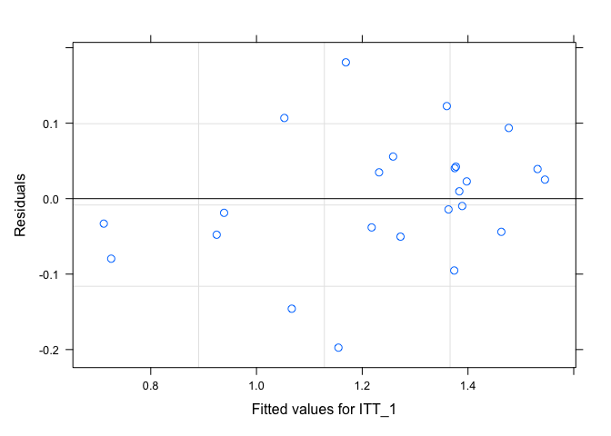
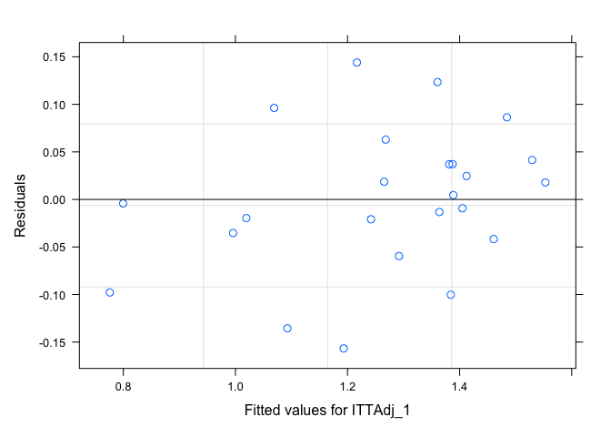
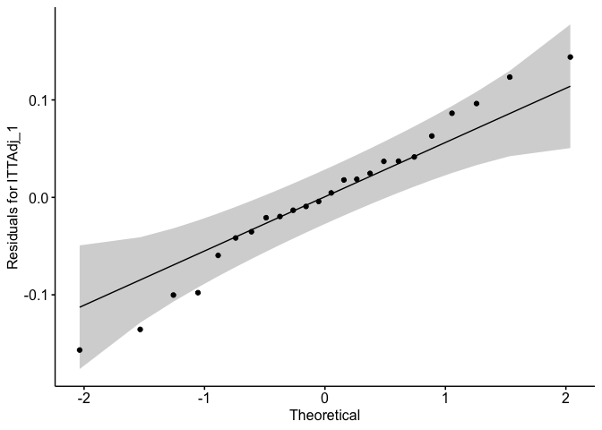
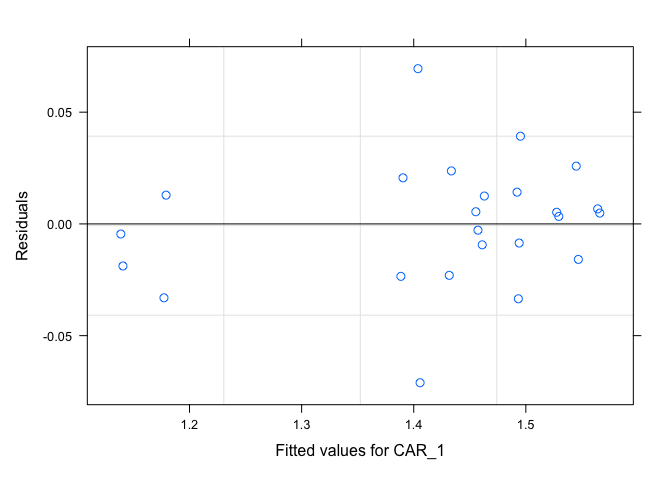
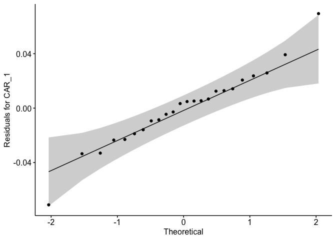
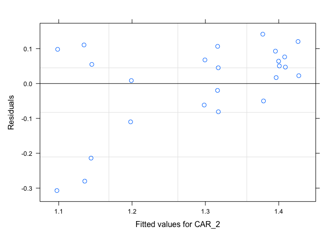
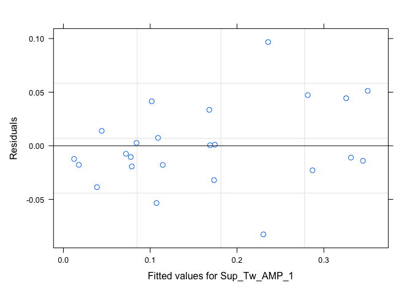
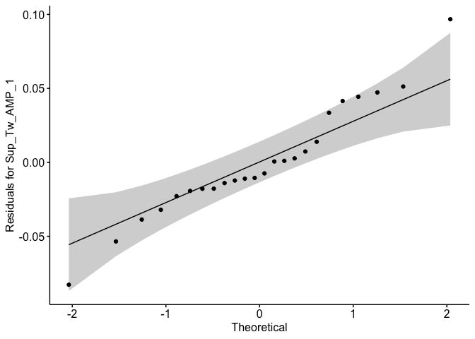
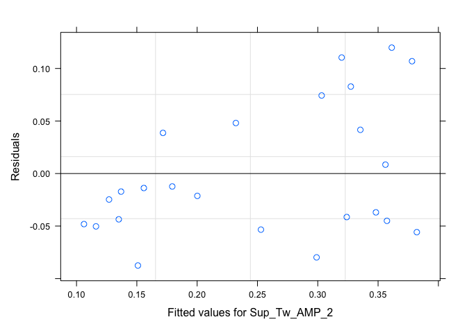
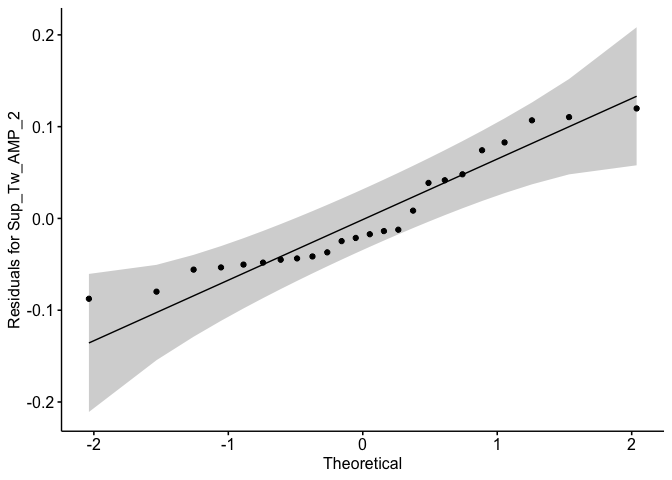

-   <a href="#statistical-analysis-plan"
    id="toc-statistical-analysis-plan">Statistical Analysis Plan</a>
-   <a href="#summary-statistics" id="toc-summary-statistics">Summary
    Statistics</a>
    -   <a href="#data-variables" id="toc-data-variables">Data Variables</a>
    -   <a href="#normality-test" id="toc-normality-test">Normality Test</a>
    -   <a href="#icc-calculations" id="toc-icc-calculations">ICC
        Calculations</a>
        -   <a href="#reliability-on-the-original-scale"
            id="toc-reliability-on-the-original-scale">Reliability on the Original
            Scale</a>
        -   <a href="#non-parametric-concordance-correlation-coefficient"
            id="toc-non-parametric-concordance-correlation-coefficient">Non-parametric
            Concordance Correlation Coefficient</a>
        -   <a href="#reliability-on-the-arcsin-transformed-scale"
            id="toc-reliability-on-the-arcsin-transformed-scale">Reliability on the
            Arcsin Transformed Scale</a>
            -   <a href="#goodness-of-the-fit-plots-for-the-model"
                id="toc-goodness-of-the-fit-plots-for-the-model">Goodness-of-the-fit
                plots for the Model</a>
-   <a href="#references" id="toc-references">References</a>

# Statistical Analysis Plan

Data is imported into R (R Core Team, 2018) for reliability analysis.
The normality of the variables is checked with Shapiro-Wilk test. For
variables which are normally distributed, a linear mixed model with
Gaussian distribution and identity link is setup to estimate
between-participant (*σ**p*2), between-test
(*σ**t*2) and error (within-participant,
*σ**ϵ*2) variance using the package (Stoffel,
Nakagawa, & Schielzeth, 2017). An ICC for test-retest reliability with
absolute agreement using single measures is calculated as described in
the following equation (Koo & Li, 2016). The confidence interval for the
ICC is constructed using 1000 parametric bootstraps.

Variables which fail the normality test, two analyses are conducted.
First, for an estimate of the ICC on the original scale, a generalised
linear mixed model is setup with Gamma distribution and identity link
using the package (Bates, Mächler, Bolker, & Walker, 2015). In addition
to location (mean) and scale (variance) parameters, Gamma distribution
also has a shape parameter allowing it to better fit skewed data.
ICC(A, 1) is estimated using the methodology described by Nakagawa,
Johnson, & Schielzeth (2017) where observation-level variance is
substituted for error variance (*σ**ϵ*2) in
equation 1. The observation-level variance is estimated from the fitted
model as follows:

where *β*0 is the overall intercept in the fitted model and
*ν* is the shape parameter of the fitted Gamma distribution. In the
cases where Gamma distribution cannot be used to fit the data, a
non-parametric measure of reliability is computed with Lin’s concordance
correlation coefficient (Steichen & Cox, 2002), (Lawrence & Lin, 1989).
The concordance coefficient quantifies the deviation of the observed
data from the line of perfect concordance (a line at 45*o*).

Second, arcsin transformation is used when possible to bring the
variable closer to normality. ICC(A, 1) is calculated on the transformed
scale using the same procedure described earlier for normal data. The
fitness of model to the data is evaluated using QQ-plot and residuals
versus fitted values plot.

The limitation of the transformed scale is that it is generally harder
to interpret although it allows application of traditional ANOVAs which
assume normality of the data for statistical inference. The advantage of
reporting reliability for both the transformed scale and the original
scale using two different approaches is that future researchers can
choose the scale which better suits their needs.

# Summary Statistics

## Data Variables

    ## 'data.frame':    24 obs. of  13 variables:
    ##  $ PID          : Factor w/ 12 levels "1","2","3","4",..: 1 2 3 4 5 6 7 8 9 10 ...
    ##  $ Test         : Factor w/ 2 levels "1","2": 1 1 1 1 1 1 1 1 1 1 ...
    ##  $ ITT_1        : num  84 59.1 100 85.5 93.6 ...
    ##  $ ITTAdj_1     : num  84.4 67.2 100 88.3 94.4 ...
    ##  $ CAR_1        : num  97.5 86.3 100 98.7 98.7 ...
    ##  $ ITT_2        : num  57.1 50.2 91.1 81.4 34 ...
    ##  $ CAR_2        : num  89.2 86.6 97.5 98.6 57 ...
    ##  $ CF_ITT       : num  26.95 8.91 8.91 4.1 59.54 ...
    ##  $ CF_CAR       : num  8.2241 -0.3125 2.4516 0.0752 41.7339 ...
    ##  $ Rest_Tw_AMP_1: num  42.6 24.2 25.6 21 30.9 ...
    ##  $ Sup_Tw_AMP_1 : num  6.81 9.91 0 3.05 1.99 ...
    ##  $ Sup_Tw_AMP_2 : num  17.39 10.28 2 3.17 21.74 ...
    ##  $ Rest_Tw_AMP_2: num  40.5 20.6 22.5 17 32.9 ...

## Normality Test

| Variable      | W.statistic |   P.Value | Sig.  |
|:--------------|------------:|----------:|:------|
| ITT_1         |   0.7566365 | 0.0000624 | TRUE  |
| ITTAdj_1      |   0.7668580 | 0.0000887 | TRUE  |
| CAR_1         |   0.6324977 | 0.0000015 | TRUE  |
| ITT_2         |   0.8798619 | 0.0082571 | TRUE  |
| CAR_2         |   0.7325573 | 0.0000280 | TRUE  |
| CF_ITT        |   0.9634983 | 0.5126192 | FALSE |
| CF_CAR        |   0.7745614 | 0.0001163 | TRUE  |
| Rest_Tw_AMP_1 |   0.9603490 | 0.4454757 | FALSE |
| Sup_Tw_AMP_1  |   0.7904843 | 0.0002067 | TRUE  |
| Rest_Tw_AMP_2 |   0.9657427 | 0.5639649 | FALSE |
| Sup_Tw_AMP_2  |   0.8989557 | 0.0204552 | TRUE  |

## ICC Calculations

### Reliability on the Original Scale

Fitting a model with Gamma distribution is not possible for ITT_2 and
Sup_Tw_AMP_1 as these contain 0 or negative values. For CF_ITT and
CF_CAR, the models failed to converge with a non-negative
between-participant variance.

The SEMs presented in the below table are on the original scale.

| Variable      | Model    |  ICC | CI.lower | CI.upper |   SEM |
|:--------------|:---------|-----:|---------:|---------:|------:|
| ITT_1         | Gamma    | 61.5 |     29.7 |     82.6 |    NA |
| ITTAdj_1      | Gamma    | 62.2 |     24.5 |     82.2 |    NA |
| CAR_1         | Gamma    | 82.1 |     63.1 |     99.4 |    NA |
| CAR_2         | Gamma    | 32.6 |    -37.0 |     31.9 |    NA |
| Rest_Tw_AMP_1 | Gaussian | 57.0 |      9.7 |     86.3 | 6.607 |
| Rest_Tw_AMP_2 | Gaussian | 72.7 |     35.3 |     91.7 | 5.160 |
| Sup_Tw_AMP_2  | Gamma    | 35.4 |     21.4 |     28.6 |    NA |

### Non-parametric Concordance Correlation Coefficient

Negative values for reliability suggest that the participants are more
different than the average similarity level obtained from random
measurements (Stoffel et al., 2017). In other words, negative values are
an evidence of zero (poor) reliability.

| Variable     |   CCC | CI.lower | CI.upper |
|:-------------|------:|---------:|---------:|
| ITT_2        |  39.3 |    -11.0 |     73.5 |
| CF_ITT       | -21.5 |    -68.3 |     37.8 |
| CF_CAR       |  -4.1 |    -56.8 |     50.9 |
| Sup_Tw_AMP_1 |  76.6 |     38.0 |     92.5 |

### Reliability on the Arcsin Transformed Scale

The variables are transformed as follows (Warton & Hui, 2011):

Arcsin transformation is not possible for ITT_2, CF_ITT and CF_CAR as
these variables contain negative values for which arcsin is not defined.

The SEMs presented in the below table are for the transformed scale.

| Variable     |  ICC | CI.lower | CI.upper |   SEM |
|:-------------|-----:|---------:|---------:|------:|
| ITT_1        | 82.2 |     56.0 |     94.2 | 0.117 |
| ITTAdj_1     | 82.2 |     51.9 |     94.6 | 0.105 |
| CAR_1        | 92.4 |     75.8 |     97.8 | 0.039 |
| CAR_2        | 48.3 |      0.0 |     83.5 | 0.153 |
| Sup_Tw_AMP_1 | 83.1 |     52.7 |     94.6 | 0.053 |
| Sup_Tw_AMP_2 | 64.7 |     19.0 |     87.8 | 0.082 |

#### Goodness-of-the-fit plots for the Model

Arcsin transformed CAR_2 has a larger number of outliers compared to the
other measures.

<!-- --><!-- --><!-- --><!-- --><!-- --><!-- --><!-- --><!-- --><!-- --><!-- --><!-- --><!-- -->

# References

Bates, D., Mächler, M., Bolker, B., & Walker, S. (2015). Fitting linear
mixed-effects models using lme4. *Journal of
Statistical Software*, *67*(1), 1–48.
<https://doi.org/10.18637/jss.v067.i01>

Koo, T. K., & Li, M. Y. (2016). A guideline of selecting and reporting
intraclass correlation coefficients for reliability research. *Journal
of Chiropractic Medicine*, *15*(2), 155–163.

Lawrence, I., & Lin, K. (1989). A concordance correlation coefficient to
evaluate reproducibility. *Biometrics*, 255–268.

Nakagawa, S., Johnson, P. C., & Schielzeth, H. (2017). The coefficient
of determination r 2 and intra-class correlation coefficient from
generalized linear mixed-effects models revisited and expanded. *Journal
of the Royal Society Interface*, *14*(134), 20170213.

R Core Team. (2018). *R: A language and environment for statistical
computing*. Retrieved from <https://www.R-project.org/>

Steichen, T. J., & Cox, N. J. (2002). A note on the concordance
correlation coefficient. *The Stata Journal*, *2*(2), 183–189.

Stoffel, M. A., Nakagawa, S., & Schielzeth, H. (2017). rptR:
Repeatability estimation and variance decomposition by generalized
linear mixed-effects models. *Methods in Ecology and Evolution*, *8*,
1639???1644. <https://doi.org/10.1111/2041-210X.12797>

Warton, D. I., & Hui, F. K. (2011). The arcsine is asinine: The analysis
of proportions in ecology. *Ecology*, *92*(1), 3–10.

